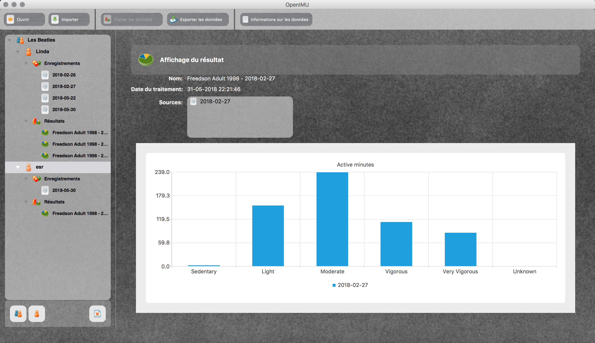
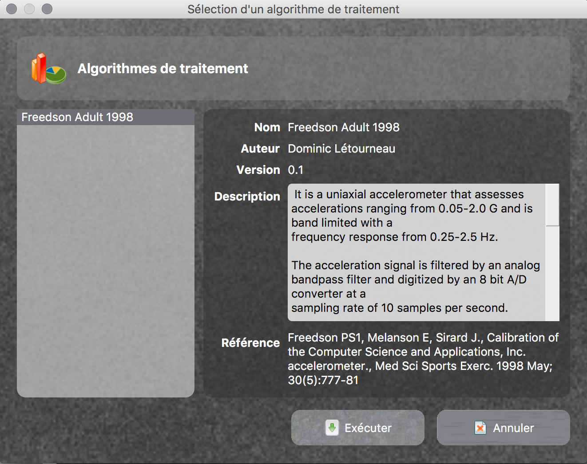
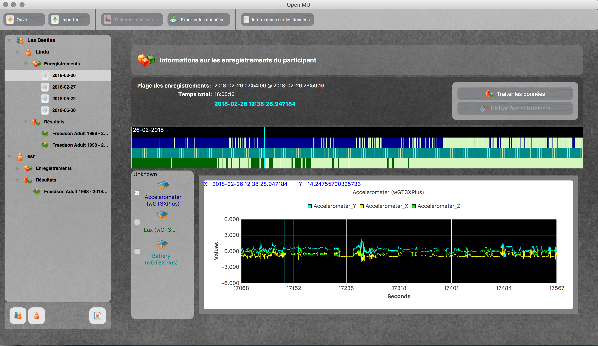

# OpenIMU - Data Analyser for Inertial Measurement Units and Actimetry Data

## Authors
  * Dominic Létourneau (@doumdi) 
  * Simon Brière (@sbriere)

## Screenshots

## Getting Started for Developers
Please follow those steps to setup your development environment.

### Requirements
 1. Make sure you have a valid compiler installed
   a. Linux : gcc/g++
   b. Mac : LLVM through XCode
   c. Windows: Visual Studio C++ 2017
   
 2. Install [CMake](https://cmake.org/download/)
 
 3. Install [Qt + QtCreator](https://www.qt.io/)
   a. Install the latest Desktop distribution fitting your compiling environment (will not be needed in the future)
   
 4. Install [MiniConda3](https://conda.io/miniconda.html)
   b. Install Python 3.6 version for current user (in user directory)
   
 5. Install [PyCharm Community Edition](https://www.jetbrains.com/pycharm/)

### Step 1 : Open the root CMakeLists.txt in QtCreator
 1. Opening the root CMakeLists.txt will allow to create and build the project
   a. Build the project, it will automatically generate the Python environment in env/python-3.6, PyQt UI and RCC files.
   b. All python dependencies will be automatically downloaded
   c. Once the project is built, you will not need QtCreator until you change or add a resource file or a QtDesigner ui file.
   d. If you change or add ui or resources files, you need to rebuild the project from QtCreator.

### Step 2 : Create a PyCharm project
 1. Using PyCharm, opening the directory "{PROJECT_ROOT}/python"
   a. Select the existing Python 3.6 environment in "{PROJECT_ROOT}/python/env/python-3.6" in the app menu :
     I. PyCharm->Preferences->Project:python->Project Interpreter
        
### Step 3 : Run the application
 1. Run the OpenIMUApp.py application from PyCharm
 
 2. Edit the code as you would normally do in a python program.
 
 3. Run tests in the tests directory

### Notes
 1. In a near future, we hope to have everything in the QtCreator IDE. Stay tuned!

Enjoy!    
