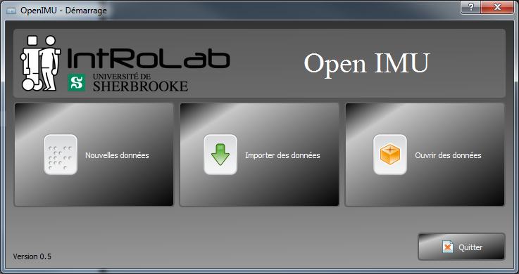
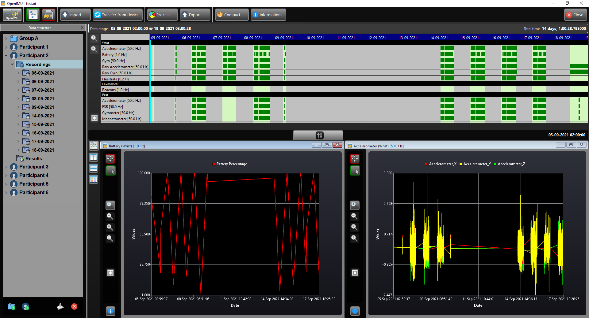
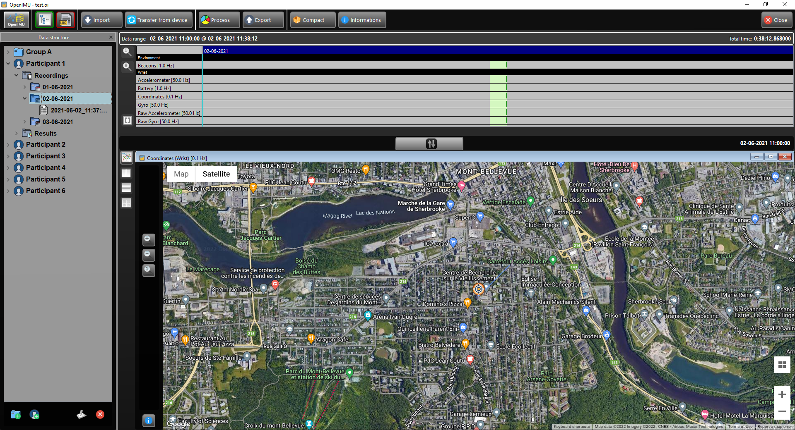
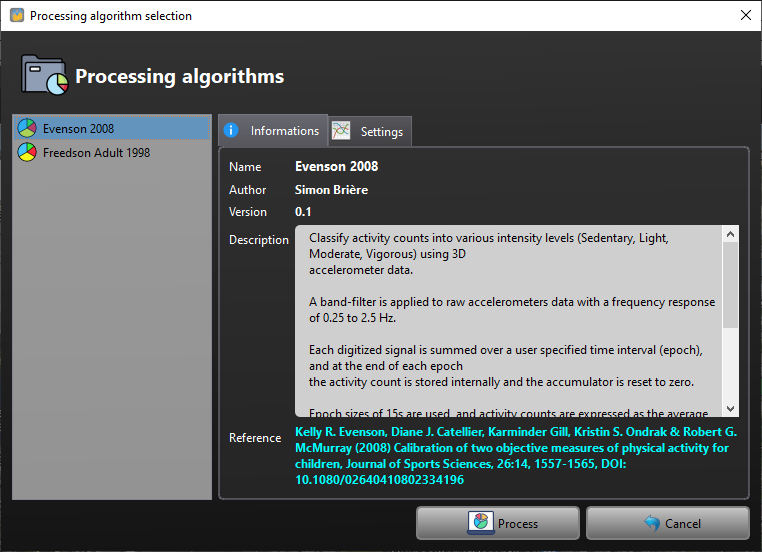
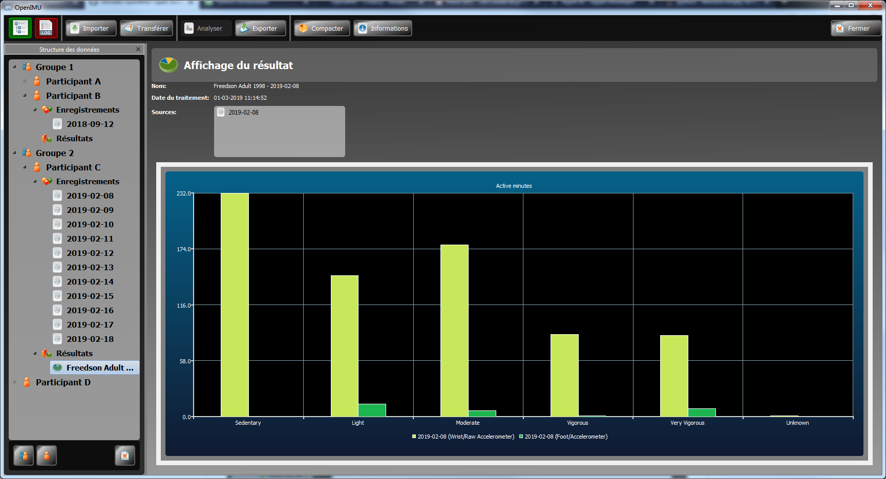

# OpenIMU - Data Analyser for Inertial Measurement Units and Actimetry Data

## Authors
*   Dominic Létourneau (@doumdi) 
*   Simon Brière (@sbriere)

## Description
OpenIMU aims to provide an open source and free generic data importer, viewer, manager, processor and exporter for Inertial Measurement Units (IMU) and actimetry data. By using a common sensor data format and structure, data from different sources can be imported and managed in the software.
This software was developped with support from [INTER](http://regroupementinter.com).

## Features

### Current features
*   Common file format (SQLite) managed by OpenIMU, but that can also be opened from other software

*   Import recorded data from sensors:
    *   [Actigraph GTX3 series](https://www.actigraphcorp.com/actigraph-wgt3x-bt)
  
    *   [OpenIMU-MiniLogger](https://github.com/introlab/OpenIMU-MiniLogger)
  
    *   AppleWatch SensorLogger (Custom research app for data collection)

*   Transfer data directly from sensors:

    *   AppleWatch SensorLogger (Custom research app for data collection)

*   Data organization

    *   By participants groups
  
    *   By participants
  
    *   By recordsets
  
    *   By results
  
*   Data viewing

    *   Temporal display of recordsets to quickly see when data was recorded

    *   Sensor graph view plotting with zoom functions

    *   GPS viewer for GPS data

*   Data processing

    *   Processing module, currently supporting:
    
        *   Freedson Activity Algorithm (Freedson PS1, Melanson E, Sirard J., Calibration of the Computer Science and Applications, Inc. accelerometer., Med Sci Sports Exerc. 1998 May;30(5):777-81)
		*	Evenson Activity Alogirhtm (Kelly R. Evenson, Diane J. Catellier, Karminder Gill, Kristin S. Ondrak & Robert G. McMurray (2008) Calibration of two objective measures of physical activity for children, Journal of Sports Sciences, 26:14, 1557-1565, DOI: 10.1080/02640410802334196 )

    *   Processed results viewer

*   Data exporter

    *   CSV format
	*	Matlab format
	*	Data export selector

* Available in French and English, and as Windows and Mac OS apps.

### Planned features

*   Data splitting into sub-recordsets (by time, by day, manually)

*   More data processing modules

## Screenshots

## Getting Started for Developers
Please follow those steps to setup your development environment.

### Requirements
1.  Make sure you have a valid compiler installed:
    1.  Linux : gcc/g++
    2.  Mac : LLVM through XCode
    3.  Windows: Visual Studio C++ 2017

2.  Install [CMake](https://cmake.org/download/)

3.  Install [Qt + QtCreator](https://www.qt.io/)
    1.  Install the latest Desktop distribution fitting your compiling environment (will not be needed in the future)
  
4.  Install [MiniConda3](https://conda.io/miniconda.html)
    
5.  Install [PyCharm Community Edition](https://www.jetbrains.com/pycharm/)

### Step 1 : Open the root CMakeLists.txt in QtCreator
1.  Opening the root CMakeLists.txt will allow to create and build the project
    1.  Build the project using the "python-all" target, it will automatically generate the Python environment in env/python-3.6, PyQt UI and RCC files.
    2.  All python dependencies will be automatically downloaded
    3.  Once the project is built, you will not need QtCreator until you change or add a resource file or a QtDesigner ui file.
    4.  If you change or add ui or resources files, you need to rebuild the project from QtCreator.

### Step 2 : Create a PyCharm project
1.  Using PyCharm, opening the directory "{PROJECT_ROOT}/python"
    1.  Select the existing Python 3.6 environment in "{PROJECT_ROOT}/python/env/python-3.6" in the app menu: PyCharm->Preferences->Project:python->Project Interpreter
        
### Step 3 : Run the application
1.  Run the OpenIMUApp.py application from PyCharm
 
2.  Edit the code as you would normally do in a python program.
 
3.  Run tests in the tests directory

### Notes
1.  In a near future, we hope to have everything in the QtCreator IDE. Stay tuned!

Enjoy!    
